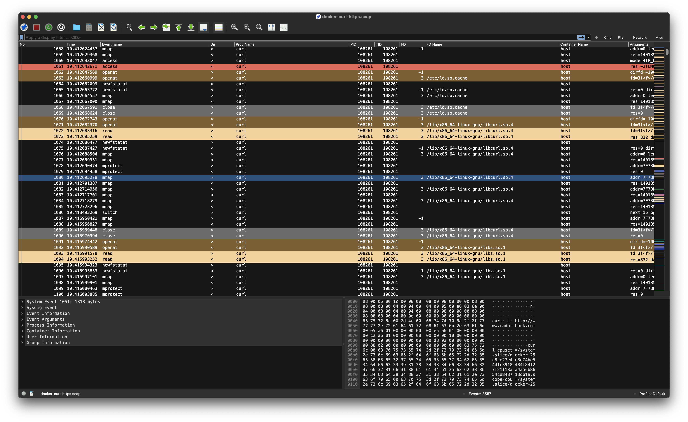
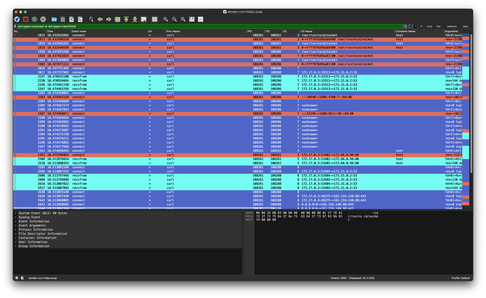
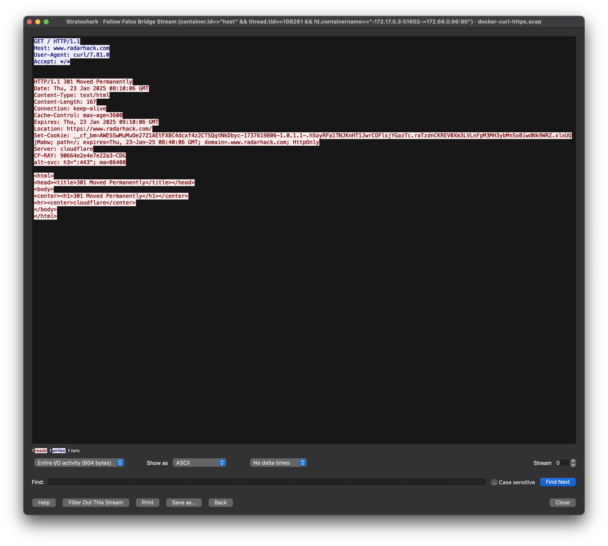
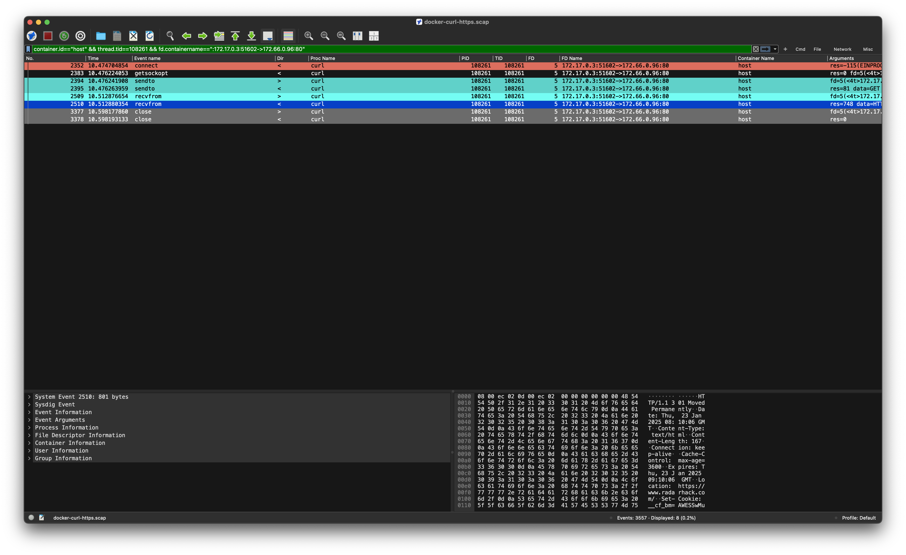
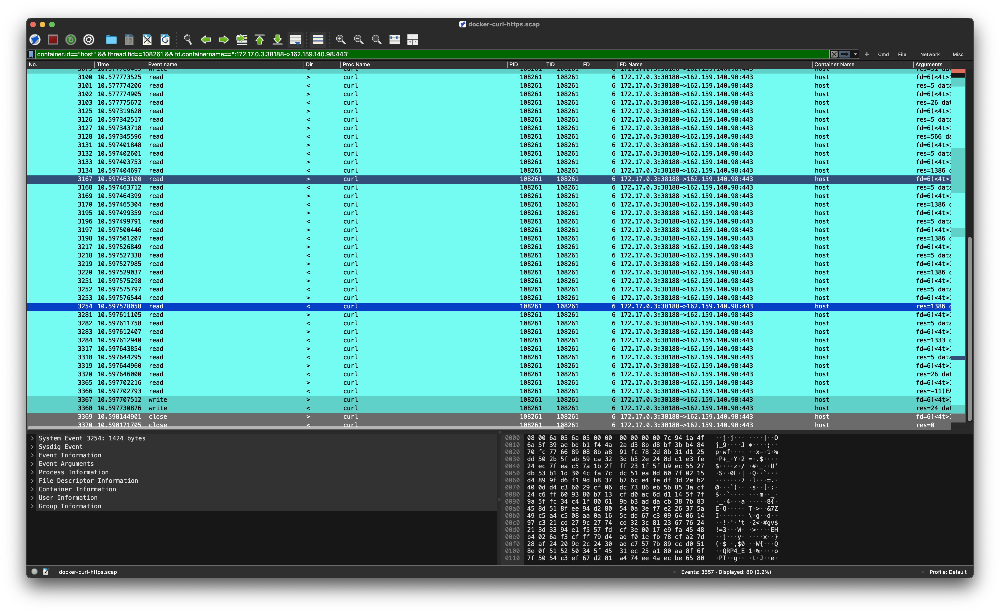
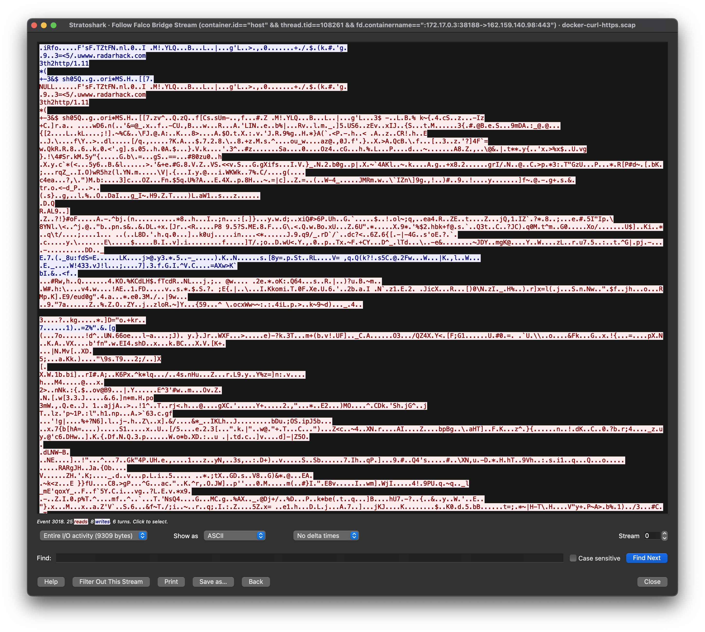
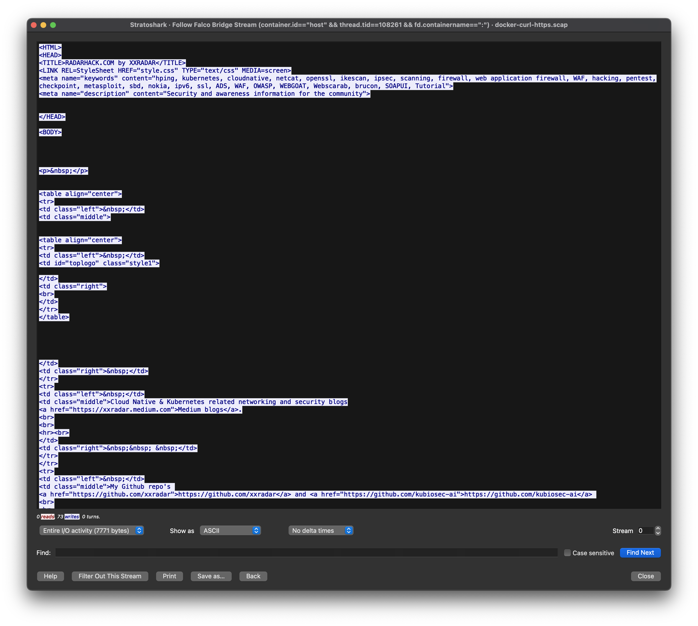

# Analyzing HTTP/HTTPS Traffic with Stratoshark

<p align="center">
  
</p>

##  Understanding System Calls: The Key to Cloud-Native Security and Observability
In the rapidly evolving world of cloud-native technologies, understanding the intricacies of system calls is critical. System calls are the fundamental interface between an application and the operating system, dictating how processes interact with system resources. This understanding underpins crucial areas like security, observability, and performance tuning.<br>
<br>
This repository introduces Stratoshark, a powerful tool for analyzing HTTP/HTTPS traffic (amongst a lot of other use-cases) at the system call level. By leveraging Sysdig and Stratoshark, we explore how system calls such as connect, sendto, recvfrom, read, and write operate during network communication. The ability to analyze these low-level interactions provides a transparent view into application behavior, helping developers, security practitioners, and system administrators detect anomalies, optimize performance, and ensure secure communications in cloud-native environments. <br>
<br>
Whether you're working on improving cloud-native security, debugging complex systems, or enhancing observability, this repository equips you with practical tools and techniques to deepen your understanding of system calls and their impact on your applications. Dive in and unlock new possibilities in system-level analysis!
<br>

## Prerequisites to get started
- Ubuntu 24.04 on AWS
- Docker 
- Sysdig CLI 
```
curl -s https://s3.amazonaws.com/download.draios.com/stable/install-sysdig | sudo bash
```

## Obtaining System Call Trace Using Sysdig CLI

First, SSH into the remote host:
```sh
ssh ubuntu@remote-host
```

Inside the terminal, run the following command to filter and capture all `curl` processes on the host:
```sh
sudo sysdig proc.name==curl -s 5000 -w docker-curl-https.scap
```
This command will save the captured data into a file named `docker-curl-https.scap`. The `-s 5000` option sets the snaplen to 5000 bytes, which is the maximum amount of data to capture per system call.

## Running `curl` inside a Docker Container

SSH into the remote host from a different terminal:
```sh
ssh ubuntu@remote-host
```

Run the following Docker command to start a container and execute a `curl` request:
```sh
docker run -t xxradar/hackon curl -L http://www.radarhack.com
```
This command will pull the `xxradar/hackon` image and run a `curl` command to fetch the specified URL. Note that our Sysdig CLI will only trace the `curl` process. If you need more data, you can modify the filter accordingly. <br>
The `curl` process inside the container will connect in cleartext to HTTP port 80 on the remote server and follow the redirect to the actual webpage using TLS and HTTPS on port 443.

## Obtaining the Sysdig Trace

Stop the trace using `Ctrl+C`. Optionally, you can also create a text version of the trace:
```sh
sudo sysdig -r docker-curl-https.scap > docker-curl-https.txt
```
This command reads the captured trace file and outputs it in a human-readable text format.

To transfer the trace files to your local machine, use the following `scp` commands:
```sh
scp ubuntu@remote-host:~/docker-curl-https.scap ./docker-curl-https.scap
scp ubuntu@remote-host:~/docker-curl-https.txt ./docker-curl-https.txt
```
These commands will securely copy the trace files from the remote host to your local machine.<br>
<br>
*Note:* If you want to follow along with the examples in the next section, you can find the trace in this repo in the `traces` directory.

## Stratoshark
The `docker-curl-https.scap` can be opened with Stratoshark, available for Mac and Windows.<br> 
(see https://www.wireshark.org/download/automated/ for downlodad)


From the UI open `docker-curl-https.scap`



### Applying a filter (HTTP part)
As you can see there are a lot of entries, so let's filter in popular `wireshark-style` and nail it down to what we are looking for.
Apply following filter
```
evt.type==connect or evt.type==recvfrom or evt.type==sendto
```


If we look carefully in `line 2395` we find the request being send.
```
2395 21:07:53.946614329 0 curl (104155) < sendto res=81 data=GET / HTTP/1.1..Host: www.radarhack.com..User-Agent: curl/7.81.0..Accept: */*...
```
In `line 2510` we can find the response
```
2510 21:07:53.972731198 0 curl (104155) < recvfrom res=748 data=HTTP/1.1 301 Moved Permanently..Date: Wed, 23 Jan 2025 10:06 GMT..Content-...
```
There is an easier way to track this all down. Select `line 2510`, click right and select `Follow -> File Descriptor Stream` and Stratoshark will do the hard work for you.

The filter is updated accordingly.


`sendto`/`recvfrom` system calls are typically used in raw socket communication, where data is sent or received directly over the network without additional abstractions. The `connect` call is used to initiate a connection.<br>
We can easily see and observe the traffic since it is in clear-text.

Note: You can so a similar exercise trying the inspect the DNS traffic, but it less readable because of the payload format of DNS. <br>
But you can easily spot the `connect` calls.

### Applying a filter (HTTPS part)
`write`/`read` system calls are seen because HTTPS uses TLS/SSL encryption, which involves additional layers of abstraction. When using libraries like libssl and libcrypto for encryption,  the application writes the data to the TLS library, which encrypts it before sending it over the socket. Similarly, received data is first decrypted by the library and then read by the application.  The encryption/decryption process hides the raw socket-level `sendto`/`recvfrom` calls from the application, and instead, you see `read`/`write`.<br>

So let's use an adjusted filter.
```
evt.type==connect or evt.type==read or evt.type==write
```

*Note:* File descriptors (FDs) are integer handles used by operating systems to identify open files, sockets, or streams. Their meaning depends on how they are assigned during program execution. When you see fd=1 in write system calls, it means the program is sending output to the terminal (stdout), unless it has been redirected to a file or another stream. fd=6 is not reserved by convention and is dynamically assigned by the operating system when a program opens a file, socket, or other resource, but in this case, it assigned to the socket.<br>

Right click `line 3100` and select `Follow -> File Descriptor Stream` and Stratoshark will show the encrypted traffic flow (FD=6)

In a later phase, the output of the `curl` process is displayed on stdio.<br>
This also happens through the process of writing to File Descriptor (FD=1).

Right click `line 3150` and select `Follow -> File Descriptor Stream` and Stratoshark will show what is printed on the console


## Conclusion

Understanding and analyzing system calls is a vital skill for anyone working in cloud-native environments, especially in areas like security and observability. By using tools like Sysdig and Stratoshark, you gain the ability to inspect low-level interactions that power applications and containers. This insight can directly contribute to use cases such as crafting Falco rules for runtime security, generating tailored seccomp profiles to minimize attack surfaces, and debugging complex system behaviors. Armed with these techniques, you are better equipped to build secure, efficient, and observable cloud-native applications.