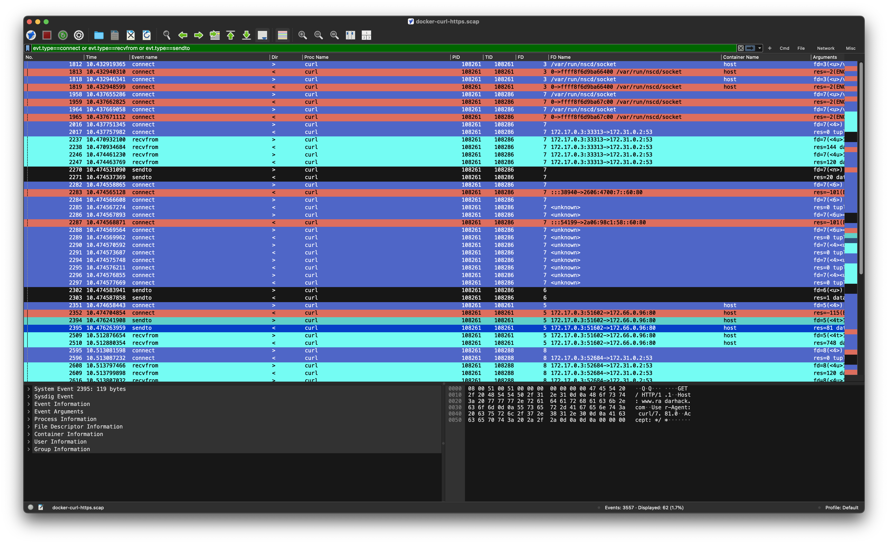

# Analyzing HTTP/HTTPS Traffic with Stratoshark

<p align="center">
  
</p>

## Prerequisites
- Ubuntu 24.04 on AWS
- Docker 
- Sysdig CLI 
```
curl -s https://s3.amazonaws.com/download.draios.com/stable/install-sysdig | sudo bash
```
## Obtaining System Call Trace Using Sysdig CLI

First, SSH into the remote host:
```sh
ssh ubuntu@remote-host
```

Inside the terminal, run the following command to filter and capture all `curl` processes on the host:
```sh
sudo sysdig proc.name==curl -s 5000 -w docker-curl-https.scap
```
This command will save the captured data into a file named `docker-curl-https.scap`. The `-s 5000` option sets the snaplen to 5000 bytes, which is the maximum amount of data to capture per system call.

## Running `curl` inside a Docker Container

SSH into the remote host from a different terminal:
```sh
ssh ubuntu@remote-host
```

Run the following Docker command to start a container and execute a `curl` request:
```sh
docker run -t xxradar/hackon curl -L http://www.radarhack.com
```
This command will pull the `xxradar/hackon` image and run a `curl` command to fetch the specified URL. Note that our Sysdig CLI will only trace the `curl` process. If you need more data, you can modify the filter accordingly. <br>
The `curl` process inside the container will connect in cleartext to HTTP port 80 on the remote server and follow the redirect to the actual webpage using TLS and HTTPS on port 443.

## Obtaining the Sysdig Trace

Stop the trace using `Ctrl+C`. Optionally, you can also create a text version of the trace:
```sh
sudo sysdig -r docker-curl-https.scap > docker-curl-https.txt
```
This command reads the captured trace file and outputs it in a human-readable text format.

To transfer the trace files to your local machine, use the following `scp` commands:
```sh
scp ubuntu@remote-host:~/docker-curl-https.scap ./docker-curl-https.scap
scp ubuntu@remote-host:~/docker-curl-https.txt ./docker-curl-https.txt
```
These commands will securely copy the trace files from the remote host to your local machine.

## Stratoshark
The `docker-curl-https.scap` can be opened with Stratoshark, available for Mac and Windows.<br> 
(see https://www.wireshark.org/download/automated/ for downlodad)

From the UI open `docker-curl-https.scap`


### Applying a filter
As you can see there are a lot of entries, so let's filter in popular `wireshark-style` and nail it down to what we are looking for.
Apply following filter
```
evt.type==connect or evt.type==recvfrom
```



For HTTPS, this is slightly different
```
evt.type==connect or evt.type==read or evt.type=write
```


